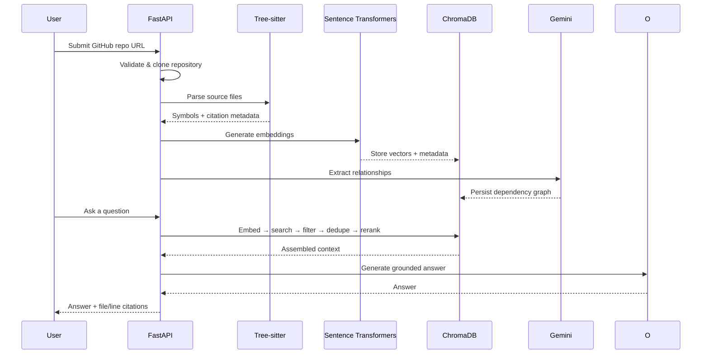

<div align="center">

# 🧭 CodeAtlas AI

**Ask questions about any GitHub repo in plain English — get grounded answers with file-and-line citations, not hallucinations.**

*A local-first, retrieval-augmented code intelligence platform. No OpenAI key. No API bill. No data leaving your machine.*

[](https://www.python.org/)
[](https://fastapi.tiangolo.com/)
[](https://react.dev/)
[](https://www.typescriptlang.org/)
[](https://www.trychroma.com/)
[](https://ai.google.dev/gemini-api)
[](LICENSE)

[Features](#-features) • [Architecture](#-architecture) • [Quick Start](#-local-installation) • [API](#-api-documentation) • [Roadmap](#-roadmap)

</div>

---

## 🚀 What is CodeAtlas AI?

CodeAtlas AI turns a raw GitHub repository into a **queryable knowledge base**. Point it at a repo, and it parses the code into real semantic units — not just text chunks — builds a searchable dependency graph, and answers natural-language questions with **retrieval-augmented generation grounded in file- and line-level citations**.

Everything runs **locally**: parsing, embeddings, vector search, and generation. No proprietary API keys, no per-token billing, no code leaving your infrastructure — which matters if you're analyzing private or sensitive codebases.

> **Why it's interesting from an engineering standpoint:** most "chat with your code" tools are thin wrappers around an LLM API and a vector store. CodeAtlas AI instead does real static analysis (Tree-sitter AST parsing → symbol/class/function extraction → dependency graph construction) *before* anything touches an embedding model, so answers are traceable back to actual code structure — not just fuzzy text similarity.

---

## ✨ Features

| | |
|---|---|
| 🔍 **Semantic Code Search** | Local Sentence Transformer embeddings + ChromaDB vector search across an entire repository |
| 💬 **Grounded Q&A** | Natural-language questions answered via RAG, with every answer traceable to source |
| 📍 **File & Line Citations** | No hallucinated references — every claim points to real code |
| 🕸️ **Dependency Graph Explorer** | Traverse files, symbols, imports, and relationships; query neighbors and shortest paths between nodes |
| 🌳 **AST-Level Parsing** | Tree-sitter extracts classes, functions, methods, interfaces, enums, and arrow functions from Python, JavaScript, and TypeScript |
| ☁️ **Grounded Gemini Answers** | Gemini generates repository-aware answers server-side with citations |
| ⚡ **Streaming Responses** | `/query/stream` for real-time, token-by-token answers |
| 🐳 **One-Command Docker Deploy** | Full stack (backend, SQLite, ChromaDB, repo storage) via Docker Compose |
| 🧩 **Clean Layered Architecture** | Strict separation between HTTP, orchestration, domain logic, and persistence |
| 🛡️ **Repository-Scoped Retrieval** | Search is isolated per repository to prevent cross-context leakage |

---

## 🏗️ Architecture

CodeAtlas AI follows a strict **ingest → understand → retrieve → generate** pipeline:

```text
                 GitHub Repository
                        │
                        ▼
                 Repository Import
                        │
        ┌───────────────┼───────────────┐
        │                               ▼
        │                      Dependency Graph
        ▼
   Tree-sitter Parser
   (AST → classes, functions,
    methods, interfaces, enums)
        │
        ▼
  Sentence Transformers
   (local embeddings)
        │
        ▼
       ChromaDB
   (vector storage)
        │
        ▼
      Retriever
 (search → filter → dedupe →
    rerank → assemble context)
        │
        ▼
       Gemini API
  (local generation)
        │
        ▼
 Grounded Answer + Citations
```

**Layered backend design:**

```text
codeatlas-ai/
├── backend/
│   ├── app/
│   │   ├── api/              # FastAPI routers — HTTP concerns only
│   │   ├── core/             # Parser, embeddings, retrieval, LLM, graph
│   │   ├── db/                # SQLite + CRUD helpers
│   │   ├── models/            # DB and API schemas
│   │   └── main.py            # Application factory & middleware
│   ├── tests/
│   ├── Dockerfile
│   ├── requirements.txt
│   └── .env.example
├── frontend/                  # Vite + React 19 client
├── docker-compose.yml
└── README.md
```

SQLite handles application metadata locally, while production can use Render
PostgreSQL via `DATABASE_URL`; ChromaDB handles searchable vectors — each
store is used for what it's actually good at, rather than forcing one database
to do both jobs.

---

## 🛠️ Tech Stack

<div align="center">

| Layer | Technology |
|---|---|
| **Backend Framework** | FastAPI |
| **Code Parsing** | Tree-sitter (multi-language AST parsing) |
| **Embeddings** | Sentence Transformers (`BAAI/bge-small-en-v1.5`, local) |
| **Vector Store** | ChromaDB |
| **LLM Inference** | Gemini (`gemini-2.5-flash`, server-side) |
| **Metadata Store** | SQLite locally / PostgreSQL on Render |
| **Frontend** | React 19 + TypeScript + Vite |
| **Frontend Data/State** | TanStack Query |
| **Frontend Routing** | React Router |
| **Visualization** | Recharts (analytics), React Flow (dependency graph) |
| **Styling** | Tailwind CSS |
| **Containerization** | Docker + Docker Compose |

</div>

---

## 📦 Requirements

- Python 3.11
- Git
- Docker & Docker Compose *(optional)*
- A Gemini API key
- 8 GB+ RAM recommended for local embedding and LLM workloads

---

## ⚙️ Local Installation

```bash
git clone https://github.com/your-org/codeatlas-ai.git
cd codeatlas-ai
python3.11 -m venv backend/.venv
source backend/.venv/bin/activate
python -m pip install --upgrade pip
python -m pip install -r backend/requirements.txt
```

**Windows (PowerShell):**

```powershell
py -3.11 -m venv backend\.venv
backend\.venv\Scripts\Activate.ps1
```

Gemini is used server-side for AI query generation. Configure the API key in the backend environment; never expose it in frontend variables.

---

## 🔧 Configuration

```bash
cp backend/.env.example backend/.env
```

| Variable | Default | Description |
|---|---|---|
| `APP_NAME` | `CodeAtlas AI` | Application name |
| `DEBUG` | `True` | Development diagnostics — set `False` in production |
| `DATABASE_URL` | `sqlite:///./codeatlas.db` locally | SQLAlchemy database URL. Set this to the Render PostgreSQL connection string in production; `postgres://` is normalized automatically to `postgresql://`. |
| `GEMINI_API_KEY` | — | Server-side Gemini API key |
| `GEMINI_MODEL` | `gemini-2.5-flash` | Generation model |
| `EMBEDDING_MODEL` | `BAAI/bge-small-en-v1.5` | Local embedding model |
| `CHROMA_DB_PATH` | `./data/chroma` | ChromaDB persistence path |
| `LOG_LEVEL` | `INFO` | Application log level |

Config resolution order: repository-root `.env` → `backend/.env` (wins on conflict) → shell environment variables (highest priority). Relative paths resolve from the repository root. `CHROMA_DB_PATH`/`CHROMA_PERSIST_DIRECTORY` are aliases.

> 🔒 Never commit `.env` files, credentials, databases, vector stores, or model caches.

For Render, create/attach a Render PostgreSQL database and configure its
internal connection string as the backend service's `DATABASE_URL` environment
variable. The backend selects PostgreSQL whenever that variable is set to a
PostgreSQL URL; otherwise it uses the local SQLite file. Startup only creates
missing tables and checks connectivity—it does not reset or overwrite existing
production data. Repository records and indexing metadata therefore remain in
PostgreSQL across deploys and restarts.

---

## ▶️ Running the Backend

```bash
cd backend
source .venv/bin/activate
DEBUG=true python -m uvicorn app.main:app --reload --host 0.0.0.0 --port 8000
```

API available at `http://localhost:8000`. Health/version checks and startup degrade gracefully when Gemini credentials are missing. All feature routers live under the `/api` prefix.

---

## 🐳 Docker Usage

```bash
# Build and start
docker compose up --build

# Run in background
docker compose up -d

# Logs / stop
docker compose logs -f backend
docker compose down
```

The Compose setup exposes port `8000`, persists SQLite/ChromaDB/repositories/logs, live-mounts `backend/app` for development, and runs as a **non-root container user**.

---

## 📖 API Documentation

Interactive docs once the backend is running:

- **Swagger UI** → [http://localhost:8000/docs](http://localhost:8000/docs)
- **ReDoc** → [http://localhost:8000/redoc](http://localhost:8000/redoc)
- **OpenAPI Schema** → [http://localhost:8000/openapi.json](http://localhost:8000/openapi.json)

<details>
<summary><strong>System</strong></summary>

```text
GET /health
GET /version
```
</details>

<details>
<summary><strong>Repository</strong></summary>

```text
POST   /repositories
GET    /repositories
GET    /repositories/{repository_id}
GET    /repositories/{repository_id}/status
POST   /repositories/{repository_id}/update
POST   /repositories/{repository_id}/reindex
DELETE /repositories/{repository_id}
GET    /repositories/health/check
```
</details>

<details>
<summary><strong>Query</strong></summary>

```text
POST /query
POST /query/stream
POST /repositories/{repository_id}/query
GET  /query/health
```
</details>

<details>
<summary><strong>Dependency Graph</strong></summary>

```text
GET /repositories/{repository_id}/graph
GET /repositories/{repository_id}/graph/statistics
GET /repositories/{repository_id}/graph/nodes
GET /repositories/{repository_id}/graph/nodes/{node_id}
GET /repositories/{repository_id}/graph/edges
GET /repositories/{repository_id}/graph/neighbors/{node_id}
GET /repositories/{repository_id}/graph/path
GET /repositories/{repository_id}/graph/health
```
</details>

---

## 🔄 How It Works



---

## 🧪 Development

```bash
# Run tests
pytest -q

# Run with coverage
pytest --cov=backend/app --cov-report=term-missing
```

Tests isolate Gemini, embedding, vector-store, filesystem, and Git operations behind deterministic fixtures and mocks — the suite never hits real network or inference services.

---

## 🖥️ Frontend Development

Vite + React 19 + TypeScript, with React Router, TanStack Query, Tailwind CSS, Recharts, and React Flow.

```bash
cd frontend
npm install
cp .env.example .env
npm run dev
```

| Variable | Default | Description |
|---|---|---|
| `VITE_API_BASE_URL` | `http://localhost:8000` | Backend origin |
| `VITE_API_PREFIX` | `/api` | FastAPI router prefix |

System endpoints (e.g. `/health`) stay on the backend origin while feature routes go through the prefixed API client. ⚠️ Never place secrets in `VITE_`-prefixed variables — they ship straight to the browser.

---

## 🚢 Production Deployment

```bash
cd frontend
npm run build
npm run preview
```

Deploy `frontend/dist` to any static host. For Vercel/Netlify: project root `frontend`, build command `npm run build`, publish directory `dist`. Set `VITE_API_BASE_URL` / `VITE_API_PREFIX` in the host's environment settings, and make sure the backend's CORS config allows the deployed frontend origin.

For a full-stack deploy, run `docker compose up --build` from the repository root — the backend owns Gemini access, SQLite, ChromaDB, and indexing, while the frontend deploys independently.

---

## 🎯 Design Principles

- **Local-first AI** — no required paid provider, no vendor lock-in
- **Strict layering** — HTTP, orchestration, domain, and persistence never bleed into each other
- **Deterministic citations** — every answer is traceable, never hand-waved
- **Typed contracts** — explicit validation end-to-end
- **Lazy model loading** — fast startup, models load only when needed
- **Repository-scoped search** — no cross-repo context leakage
- **Graceful degradation** — partial failures during indexing/retrieval don't take down the system

---

## 🗺️ Roadmap

- [ ] Go, Rust, Java, and C# parsing
- [ ] Improved call-graph and cross-file reference resolution
- [ ] Incremental indexing via file checksums and Git commits
- [ ] Background job queues for large repositories
- [ ] Hybrid lexical + semantic retrieval
- [ ] Richer interactive graph visualization
- [ ] Multi-user workspaces and access controls
- [ ] Metrics, tracing, and production deployment manifests
- [ ] Dedicated global search endpoint (files + symbols)
- [ ] Dedicated analytics endpoint (commits, storage, processing history)
- [ ] End-to-end browser tests and visual regression coverage

---

## 📸 Screenshots

*Coming soon — dashboard, repository workspace, AI chat, dependency graph, and analytics views, in both dark and light themes.* Drop images under `docs/screenshots/` to populate this section.

---

## 📄 License

Distributed under the license included in [`LICENSE`](LICENSE).

<div align="center">

**Built for developers who want to understand a codebase, not just search it.**

</div>
